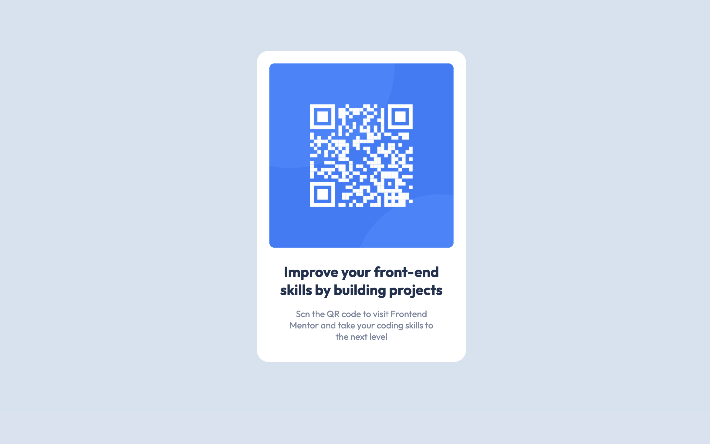

# Frontend Mentor - QR code component solution

This is a solution to the [QR code component challenge on Frontend Mentor](https://www.frontendmentor.io/challenges/qr-code-component-iux_sIO_H). Frontend Mentor challenges help you improve your coding skills by building realistic projects.

## Table of contents

- [Overview](#overview)
  - [Screenshot](#screenshot)
- [My process](#my-process)
  - [Built with](#built-with)
  - [What I learned](#what-i-learned)
  - [Continued development](#continued-development)
- [Author](#author)

## Overview

This project is my solution to the [QR code component challenge on Frontend Mentor](https://www.frontendmentor.io/challenges/qr-code-component-iux_sIO_H). The challenge, presented by Frontend Mentor, aimed to enhance my coding skills by providing a realistic project to work on.

### Screenshot



## My Process

Creating the QR code component was an engaging journey that involved careful planning, design decisions, and coding. Here's a breakdown of my process:

I started by structuring the HTML with semantic elements to ensure a meaningful and accessible document outline. The main content, including the QR code image, headline, and description, were organized within a container using Flexbox for easy alignment.

```html
<div class="container">
  <div class="card">
    <!-- QR code image, headline, and description -->
  </div>
</div>
```

### Built with

- Semantic HTML5 markup
- CSS custom properties
- Flexbox

### What I learned

- Employed semantic HTML5 markup to enhance code readability and structure.
- Implemented a mobile-first approach, ensuring a responsive design for various screen sizes.
- Utilized Flexbox for effortless and responsive alignment of content.
- Styled elements with CSS properties, including color, padding, and border-radius, for a visually appealing presentation.
- Incorporated media queries to optimize the layout for smaller screens, demonstrating adaptability.

### Continued development

- Deepen understanding of CSS Grid for enhanced layout control.
- Explore advanced responsive design techniques.
- Dive into accessibility practices for a more inclusive user experience.
- Experiment with CSS animations and transitions.
- Collaborate on projects to gain insights into team-based development.

## Author

- Website - [Will create one soon](will be added soon)
- Frontend Mentor - [@GlT-ignore](https://www.frontendmentor.io/profile/GlT-ignore)
- Twitter - [@CGajjarapu](https://twitter.com/CGajjarapu)
